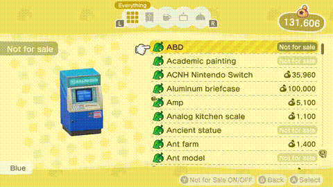
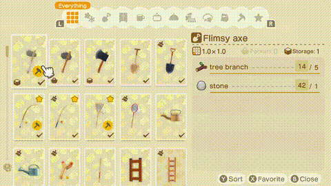
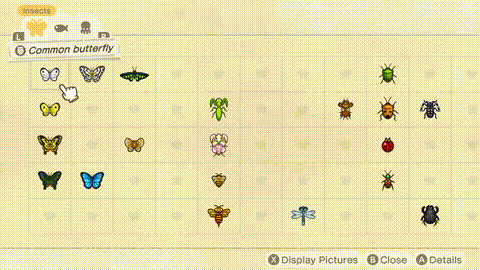
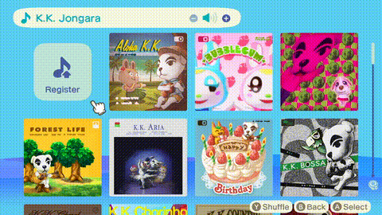
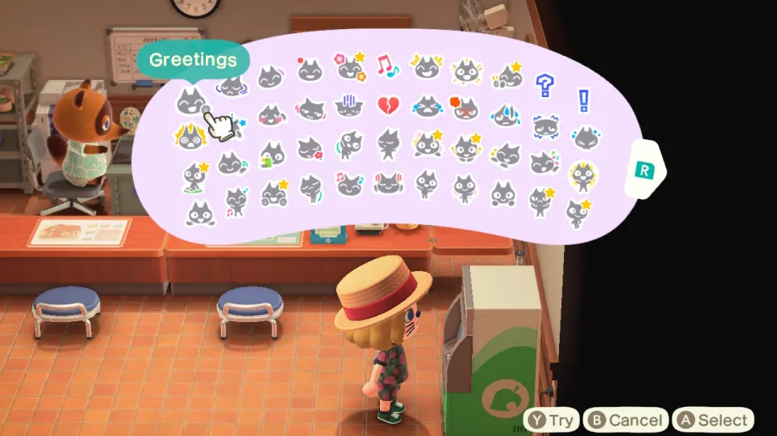

<!-- markdownlint-disable MD033 -->
<!-- markdownlint-disable MD036 -->
<!-- markdownlint-disable MD013 -->

# CatalogScanner [](https://www.python.org/downloads/) [](https://opensource.org/licenses/LGPL-3.0)

<!-- markdownlint-enable MD013 -->

Script to scan video or screenshots of user scrolling through their ACNH Nook
Shop catalog, DIY recipes list, critters, song list, reactions and more.

Includes a Telegram Bot for ease of use.
[Try it out!](https://t.me/ACNHScannerBot)!

This repo is a fork of the original
[CatalogScanner](https://github.com/EhsanKia/CatalogScanner) by
[Ehsan Kia](https://twitter.com/ehsankia_) which had the Twitter bot and later
on a Discord bot. I use neither of those platforms, so I decided to make a
Telegram bot.

## Installation

Prerequisites:

- Python 3.12+
- Tesseract-OCR
- Poetry

### Tesseract-OCR

This package uses
[Tesseract-OCR](https://github.com/tesseract-ocr/tesseract/wiki) to read the
text from the screenshots / video. You need to install it first.

With the installation of the binary, you need to install the language packs for
the languages supported by the script. You can find the list in
[pacman-deps.txt](pacman-deps.txt).

For Arch Linux users, you can install the required packages with the provided
script after cloning the repo (this also installs the python dependencies):

```shell
./install.sh
```

In addition to the language packs you also need a tesseract script file. You can
download it from their Github repository. Make sure you download it to the right
place for your platform.

```shell
sudo mkdir -p /usr/share/tessdata/script
sudo curl "https://raw.githubusercontent.com/tesseract-ocr/tessdata/main/script/Latin.traineddata" -o /usr/share/tessdata/script/Latin.traineddata
```

### Python

You can install the required libraries using
[Poetry](https://python-poetry.org/):

```shell
git clone https://github.com/Nachtalb/CatalogScanner
cd CatalogScanner
poetry install
# if you want to use the Telegram bot
poetry install --with bot

poetry shell  # to activate the virtual environment
```

## Usage

Before using this script, you need to create a valid video file. You can find
instructions on how to do so here:
[Exporting the Catalog](#exporting-the-catalog).

When you have your video / screenshots, you can scan them with the script:

```shell
catalogscanner catalog.mp4
# explore the help for more options
catalogscanner --help
```

If you have screenshots, you can pass it as is if there is a single one,
otherwise you need to number them starting with 0 and pass the filename with
`%d` instead of the numbers.

```sh
catalogscanner catalog_%d.png
```

By default, it will detect the media type (catalog, recipes, etc), but you can
force on with `--mode`.

You can use `--for_sale` to filter out items that are not purchasable, and you
can use `--locale` to adjust the parsed language. By default, the script prints
out the name of all the items found in your catalog video.

### Exporting the Catalog

To use the scanner, first record a video or take screenshots of what you want to
scan. Then, simply send the video or screenshot to the bot. You'll receive a
list of items that you can import into your tracker.

These instructions are also available
[here](https://telegra.ph/Animal-Crossing-New-Horizons-Catalog-Scanner-07-05)

<details>
<summary>🛍️ Nook Shopping</summary>

1. Open Nook Shopping on the ATM or phone
2. Select the desired catalogue and optionally a subsection
3. Scroll to the bottom by holding down the **right analog stick**
4. Hold the "Capture" button (left Joy-Con) to record the last 30 seconds
5. Open the Switch's Album gallery and select your video
6. **Trim the video to include only the start and end of the scrolling**
7. Send the video to your phone using
   "[Send to smart device](https://www.nintendo.com/au/support/articles/how-to-transfer-screenshots-and-video-captures-to-a-smart-device-wirelessly/)"
8. Send the video to the Telegram bot
   [@ACNHScannerBot](https://t.me/ACNHScannerBot)

[](docs/images/videos/nook-shopping.mp4)

_Click the GIF to view the full video_

</details>

<details>
<summary>🛠️ DIY Recipes</summary>

1. Open your DIY Recipes on your phone
2. Scroll to the bottom holding the **left analog stick**
3. Hold the "Capture" button (left Joy-Con) to record the last 30 seconds
4. Open the Switch's Album gallery and select your video
5. **Trim the video to include only the start and end of the scrolling**
6. Send the video to your phone using
   "[Send to smart device](https://www.nintendo.com/au/support/articles/how-to-transfer-screenshots-and-video-captures-to-a-smart-device-wirelessly/)"
7. Send the video to the Telegram bot
   [@ACNHScannerBot](https://t.me/ACNHScannerBot)

[](docs/images/videos/diy-recipes.mp4)

_Click the GIF to view the full video_

</details>

<details>
<summary>🐛 Critterpedia</summary>

1. Open Critterpedia on your phone
2. Make sure you are in **List Mode**, not _Display Mode_
3. Move through every section to view all Bugs, Fish, and Sea Creatures
4. Hold the "Capture" button (left Joy-Con) to record the last 30 seconds
5. Open the Switch's Album gallery and select your video
6. **Trim the video to include only the start and end of the scrolling**
7. Send the video to your phone using
   "[Send to smart device](https://www.nintendo.com/au/support/articles/how-to-transfer-screenshots-and-video-captures-to-a-smart-device-wirelessly/)"
8. Send the video to the Telegram bot
   [@ACNHScannerBot](https://t.me/ACNHScannerBot)

[](docs/images/videos/critterpedia.mp4)

_Click the GIF to view the full video_

</details>

<details>
<summary>🎵 Music</summary>

1. Open your song list by interacting with any music player
2. Scroll to the bottom using the **left analog stick**
3. Hold the "Capture" button (left Joy-Con) to record the last 30 seconds
4. Open the Switch's Album gallery and select your video
5. **Trim the video to include only the start and end of the scrolling**
6. Send the video to your phone using
   "[Send to smart device](https://www.nintendo.com/au/support/articles/how-to-transfer-screenshots-and-video-captures-to-a-smart-device-wirelessly/)"
7. Send the video to the Telegram bot
   [@ACNHScannerBot](https://t.me/ACNHScannerBot)

[](docs/images/videos/music.mp4)

_Click the GIF to view the full video_

</details>

<details>
<summary>😍 Reactions</summary>

1. Press **ZR** to open the Reactions Wheel
2. Press **Y** to access the full list of reactions
3. Move your cursor to an empty spot or the top right corner
4. Press the "Capture" button (left Joy-Con) to save a screenshot
5. Open the Switch's Album gallery and select your screenshot
6. Send the screenshot to your phone using
   "[Send to smart device](https://www.nintendo.com/au/support/articles/how-to-transfer-screenshots-and-video-captures-to-a-smart-device-wirelessly/)"
7. Send the screenshot to the Telegram bot
   [@ACNHScannerBot](https://t.me/ACNHScannerBot)



</details>

## Credits

Original script by [Ehsan Kia](https://twitter.com/ehsankia_).

The item name data comes from:

- <https://tinyurl.com/acnh-sheet>
- <https://github.com/imthe666st/ACNH>
- <https://github.com/alexislours/translation-sheet-data>

## Licensing

This project is dual-licensed:

- Original work: MIT License ([LICENSE-MIT](LICENSE-MIT))
- Modifications and new files: GNU Lesser General Public License v3.0
  ([LICENSE](LICENSE))

Individual files contain SPDX license identifiers indicating applicable
license(s). When using or distributing this software, please comply with both
licenses.
